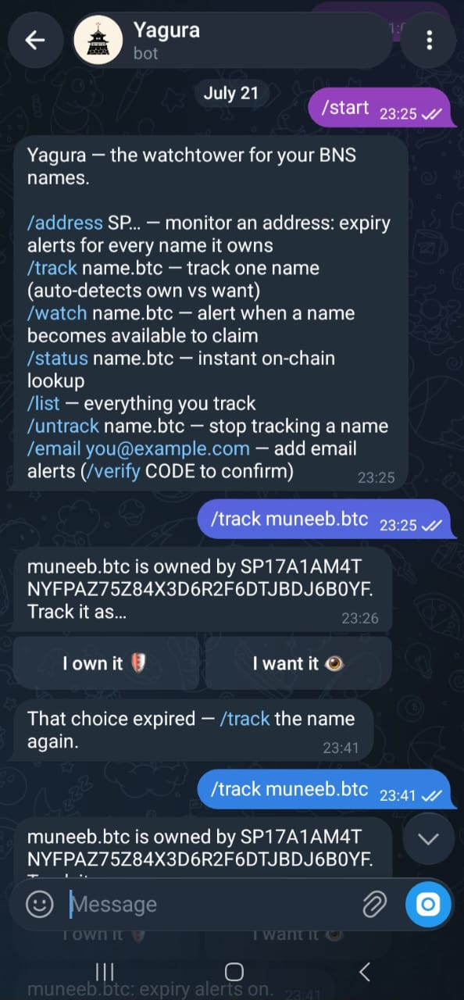

# Yagura（櫓）

**The watchtower for your BNS names. Never lose the one you own. Never miss the one you want.**

A *yagura* is the lookout tower on a Japanese castle — built so danger is seen
while there is still time to act. This Yagura watches the
[Bitcoin Name System](https://docs.stacks.co/learn/network-fundamentals/bitcoin-name-system)
on Stacks and does two things, excellently:

- **Expiry alerts (defensive).** Tell it your Stacks address — or connect a
  wallet — and every BNS name you own is monitored. You get Telegram/email
  warnings ~30, 7 and 1 days before expiry, again when the grace period
  starts, and once more halfway through it. Every alert carries a one-tap
  renewal link that opens your wallet with the correct `name-renewal`
  contract call pre-filled and the STX burn pinned by a post-condition.
- **Availability watch (offensive).** Watch any name someone else holds.
  The first poll after it becomes claimable again, you get pinged with a
  registration link.

Yagura is the push-based notification layer that complements
[BNS One](https://bns.one)'s dashboard — we alert, they handle registration.
MIT licensed, built to run on free tiers.

> **Status:** feature-complete MVP (monitor + alert + one-tap renew), live at
> [yagura-two.vercel.app](https://yagura-two.vercel.app).

## Screenshots

The Telegram bot in action — `/start`, then `/track muneeb.btc` auto-detecting
that the name is owned by someone else and asking own-vs-want:



## Architecture

```
                        ┌────────────────────────────────┐
   Hiro Stacks API ◄────┤  GitHub Actions (cron */10)    │
   BNS V2 indexer  ◄────┤  apps/worker poll-once.ts:     │
   (api.bnsv2.com)      │  discover → refresh state →    │
                        │  owner changes → enqueue →     │────► Telegram (send-only)
                        │  drain alert queue, then exit  │────► Email (Resend/console)
                        └───────────────┬────────────────┘
                                        │ Drizzle ORM
                        ┌───────────────▼────────────────┐
                        │  Postgres (Neon)               │
                        │  users · tracked_addresses ·   │
                        │  tracked_names · name_state ·  │
                        │  alerts_sent (ledger+queue) ·  │
                        │  pending_tracks                │
                        └───────────────▲────────────────┘
                                        │
                        ┌───────────────┴────────────────┐
   Hiro Stacks API ◄────┤  apps/web (Next.js, Vercel)    │
   wallet (Leather/ ◄───┤  landing · dashboard ·         │
   Xverse via           │  /name/[fqn] · /renew/[fqn] ·  │
   @stacks/connect)     │  /metrics · /unsubscribe ·     │◄──── Telegram webhook
   Telegram ────────────┤  /api/telegram/webhook (bot)   │      (inbound commands)
                        └────────────────────────────────┘
              shared logic: packages/core (@yagura/core), packages/bot (@yagura/bot)
   BNS client · status rules · block-time · alert tiers · DB schema · bot commands · email
```

Three free-tier services, no server to keep alive: GitHub Actions runs the
poller on a schedule, Vercel hosts the web app *and* the bot's webhook
(both stateless), Neon holds the one shared Postgres database.

## BNS V2 facts this code relies on

All verified live against the deployed mainnet contract source and on-chain
reads (2026-07-19) — see `packages/core/src/constants.ts`:

| Fact | Value |
| --- | --- |
| Mainnet contract | `SP2QEZ06AGJ3RKJPBV14SY1V5BBFNAW33D96YPGZF.BNS-V2` (names are SIP-09 NFTs) |
| Expiry unit | Bitcoin **burn block heights** (dates shown are estimates at ~10 min/block, recomputed every poll) |
| Grace period | `5000` burn blocks (~34.7 days), global constant, owner-only renewal window |
| After grace | The name is immediately acquirable by **anyone** via `name-renewal` — there is no separate re-registration flow |
| Renewal entrypoint | `(name-renewal (namespace (buff 20)) (name (buff 48)))` — the contract computes the price (`get-name-price`) and burns it from the caller |
| `.btc` lifetime | 262,800 blocks (~5 years) |
| `.id` lifetime | 52,595 blocks (~1 year) |
| `.stx`, `.app` | lifetime 0 — **never expire** |
| Managed namespaces (e.g. `.mega`, `.sats`) | lifetime 0 + manager contract — renewals live outside BNS-V2; treated as non-expiring |
| Imported names | `renewal-height` 0 means expiry = namespace `launched-at` + lifetime |

Namespace lifetimes are read from the chain at runtime — the table is
documentation, not configuration.

## Monorepo

```
packages/core   @yagura/core   BNS client, status derivation, block-time estimation,
                               alert-tier rules, Drizzle schema, dev CLI
packages/bot    @yagura/bot    Telegram bot commands, webhook handler, alert
                               rendering, pluggable email — shared by worker + web
apps/worker     @yagura/worker Single-shot poll cycle (run by GitHub Actions cron):
                               refresh state, enqueue alerts, drain the queue
apps/web        @yagura/web    Next.js app: landing, wallet dashboard, /name/[fqn],
                               /renew/[fqn], /metrics, /unsubscribe, and the
                               Telegram webhook route (/api/telegram/webhook)
```

**Database.** Postgres everywhere, via Drizzle. Production points
`YAGURA_DATABASE_URL` at [Neon](https://neon.tech) (or any managed Postgres);
local dev and all tests use [PGlite](https://pglite.dev) (real Postgres
compiled to WASM, in-process) with zero setup — same schema, same SQL, no
dialect drift. Migrations ship in `packages/core/drizzle` and apply
automatically at the start of every poll run. (The web app needs the same
`postgres://` URL for metrics/unsubscribe/the bot; without one it serves its
chain-only pages happily and the webhook route fails closed.)

**Reliability rules.** A failed fetch is "no new information" — never "the
name is gone", and never an availability alert; ambiguous chain data derives
status `unknown`, which never alerts. Every alert tier fires at most once per
(user, name), enforced by a unique index on the `alerts_sent` ledger — the
same table doubles as the outbound queue and the metrics source. Dead
channels stop deliveries (blocked bot, bounced email) and revive when the
user returns.

## Quickstart (dev)

```bash
pnpm install
pnpm build                # core first — worker/web import its dist
pnpm test                 # core units (fixtures) + worker integration (PGlite)

pnpm bns status muneeb.btc    # live mainnet lookup from the CLI
pnpm bns price muneeb.btc     # renewal burn price

# run the watchtower with an embedded database:
cd apps/worker
pnpm ops add-user                       # → prints a user id
pnpm ops track-address <id> SP...       # defensive: monitor an address
pnpm ops track-name <id> rare.btc want  # offensive: watch a name
pnpm ops run-once && pnpm ops alerts    # one poll cycle, inspect the queue
pnpm poll                               # the same cycle GitHub Actions runs on cron

# run the web app:
cd apps/web && pnpm dev                 # http://localhost:3000
```

**Telegram bot:** `/start` · `/address SP…` · `/track name.btc` (auto-detects
own vs want) · `/watch name.btc` · `/status name.btc` · `/list` ·
`/untrack name.btc` · `/email you@example.com` + `/verify CODE`

## Self-hosting (one documented path: Neon + Vercel + GitHub Actions, all free)

No server to keep alive, anywhere. Three free tiers, wired together:

| Service | Runs | Free tier fit |
| --- | --- | --- |
| [Neon](https://neon.tech) | Postgres — the one shared database | Generous free plan, no expiry |
| [Vercel](https://vercel.com) | Web app + Telegram webhook route | Free Hobby plan; both are on-demand serverless |
| [GitHub Actions](https://github.com/features/actions) | The poller, on a `*/10 * * * *` cron | Free for public repos (~4,320 min/mo used, well under the free private-repo quota too) |

1. Fork/clone this repo and push it to your GitHub.
2. Create a Telegram bot with [@BotFather](https://t.me/BotFather); note the
   token and the bot's username. Pick a long random string yourself for the
   webhook secret (e.g. `openssl rand -hex 32`) — Telegram never generates
   this one, you invent it and use it in both places below.
3. (Optional) Create a [Resend](https://resend.com) API key and verified
   sender for email alerts — skip to run Telegram-only.
4. Create a [Neon](https://neon.tech) project and copy its `postgres://`
   connection string (the pooled one is fine — every consumer here is
   either a single script run or a short-lived serverless invocation).
5. **On GitHub:** repo **Settings → Secrets and variables → Actions**, add
   as *secrets*: `YAGURA_DATABASE_URL` (the Neon string),
   `YAGURA_TELEGRAM_BOT_TOKEN`, `YAGURA_WEB_BASE_URL` (your Vercel URL —
   fill in after step 6), and — for email — `YAGURA_RESEND_API_KEY` +
   `YAGURA_EMAIL_FROM`. Add `YAGURA_EMAIL_PROVIDER` as a *variable* (not a
   secret) set to `resend`, or leave it unset to log emails to the Actions
   log instead of sending them. `.github/workflows/poll.yml` picks all of
   these up on its cron schedule — no further setup, it starts running
   the moment the secrets exist.
6. **On Vercel:** import the repo, set **Root Directory** to `apps/web`
   (Next.js + the pnpm workspace are auto-detected). Add these env vars:
   `YAGURA_DATABASE_URL` (same Neon string — for metrics/unsubscribe/bot),
   `YAGURA_TELEGRAM_BOT_TOKEN`, `YAGURA_TELEGRAM_WEBHOOK_SECRET` (the
   string from step 2), and `YAGURA_TELEGRAM_BOT_USERNAME` (for deep-links).
   For email verification codes from the bot's `/email` command, also add
   `YAGURA_EMAIL_PROVIDER=resend` + `YAGURA_RESEND_API_KEY` +
   `YAGURA_EMAIL_FROM`. Deploy.
7. Register the webhook with Telegram (once — it stays registered across
   deploys):
   ```
   curl "https://api.telegram.org/bot<TOKEN>/setWebhook?url=<VERCEL_URL>/api/telegram/webhook&secret_token=<WEBHOOK_SECRET>"
   ```
8. Back on GitHub, fill in `YAGURA_WEB_BASE_URL` from step 5 with the real
   Vercel URL now that it exists (it's only used for renewal/unsubscribe
   links inside alert messages).
9. Message your bot `/start`. Done — the tower is watching, and nothing
   you deployed has an idle cost.

An optional Hiro API key (`YAGURA_HIRO_API_KEY`, free at platform.hiro.so)
raises rate limits; the public tier is fine for hundreds of names. Add it
as a GitHub Actions secret alongside the others in step 5.

## What Yagura deliberately is not

No marketplace, no valuations, no registration flow (BNS One does that
well), no mobile app, no paid tiers. Monitor + alert + one-tap renew, done
carefully.

---

*Built with support from Stacks DeGrants (placeholder).*
